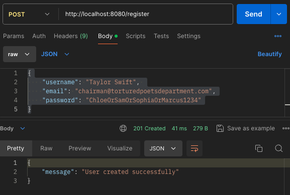
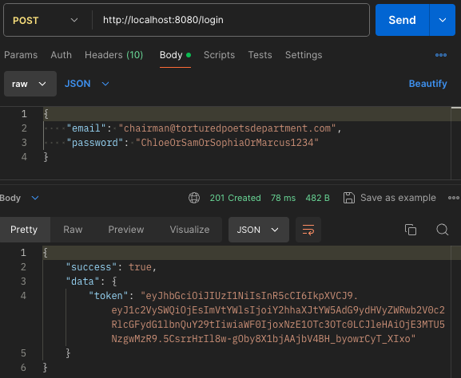
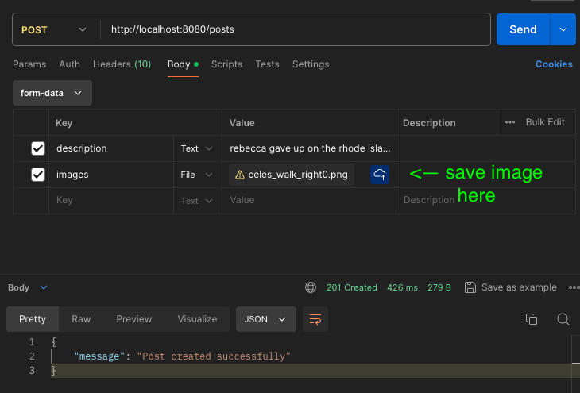

# TrueMates
TrueMates backend project, demonstrating blog functionality built in an Express Backend with database and blob storage functionality.

## Overview
TrueMates is a backend that provides an API that handles user login and authentication (via JWT), post storage, and post retrieval, and friends management. The backend is written in Express hosted locally on your machine. For data storage, we use the following: 
- A locally hosted instance of PostgreSQL
- Sequelize for our Object-Relational Mapping. 
- Google Cloud Bucket for blog storage (images, primarily).

## Running the App:
To run this, you can clone the git repo, build your environment variables to your own settings, ensure you have all of the dependencies installed, and run npm start. Also note the program requires settings for your Google Cloud Bucket, so be sure to update these as well.

## Structure of TrueMates app
The main entry of the app is index.js. Here we instantiate the express instance, define routes, instantiate Sequelize and apply some settings. 
- We define routes in the routes folders. This houses things like authentication (using JWT), post creation, and user creation via register. These are built like controllers and only houses the business logic and firing of the CRUD operations.  
- The models folder houses all the models for items that get stored in the RDB tables. It also contains all logic for database manipulations, exclusively, for separation of concerns. 
- In config, we set all of our configuration files. Currently we have:
    - Google database connection and manipulations
    - Sequelize instantiation 
- The migrations folder defines our Postgresql tables creation and schema. 

### API Endpoints Guide

#### POST /register
Register a user. Requiers in the body 3 fields: 
- username
- email
- password

Currently, we do not require any restrictions to these fields. They are simply strings.

*POST /register sample call in Postman:*

#### POST /login
Log a user in. Provide 2 fields in the body: 
- email
- password

If you are successfully authenticated, you'll receive the JWT token in the payload. 

*POST /login sample call in Postman:*

#### POST /posts
Create a post. We require the user to be logged in and to pass the JWT tokens in the Authorization header of HTTP request. We also need in the body: 
- description: the descriptionn of the post
- images: the image(s) uploaded to the post. Only up to 1 (and later, up to 5 in a future build) image(s) is(are) allowed.

*POST /posts sample call in Postman - define the image(s):*

*POST /posts sample call in Postman - add the jwt token:*

### Future API Endpoints (NOT BUILT YET)

#### GET /posts/:postId/time
Post returning api will calculate the time difference like 2s ago, 10d ago, 4w ago, 8m ago and 1yr ago. This specifically will return the time difference: 
*currentTime - createdTime.*

#### PUT /posts/:postId/description
Update the post description associated with the post id. 

#### POST /friends/add
Add friend. Requiers login. 

#### GET /friends
Friends List endpoint returns friends' info and number of mutual friends (i.e. count of common friends of friend A - yourself, and friend B). Requires login. 

### PostgreSQL Database Guide
Here's a summary of our tables below:
- User - houses user id and metadata for user (name, email, creation).
- Post - contains post data: description and array of image id’s.
- Login - contains user id and pw.
- Image - images ids and their post they belong to. image ids are the keys to the associated images stored in blob storage.  

### Google Cloud Bucket Guide
Image names are the id’s that are defined in the image file. We then use the image id to do key retrieval when we save and retrieve images from the bucket. 

### Some important notes
- In our environment variables, we code size limits on images, HTML requests on file size, token duration limitations

### In future builds we plan to build: 
- Currently, we don’t make any distinctions between production, development, or test. We want to update the program to apply database pointers to these environment differences. 
- Apply encryption to customer metadata and login.
- Centralized constants and messages used for errors.
- Input validation for request data. For example, verifying that an email is indeed an email, that a password contains enough complexity, that names have sufficient length, etc.
- A rate limiter.
- A cache for frequently used resources.
